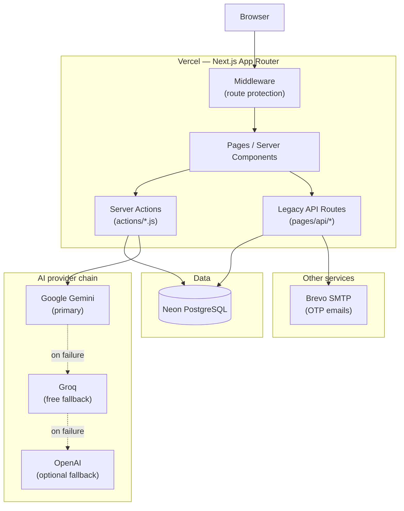
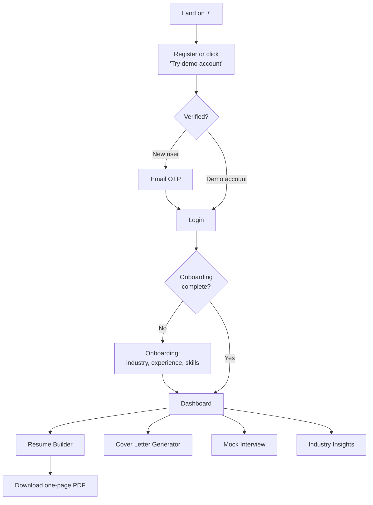
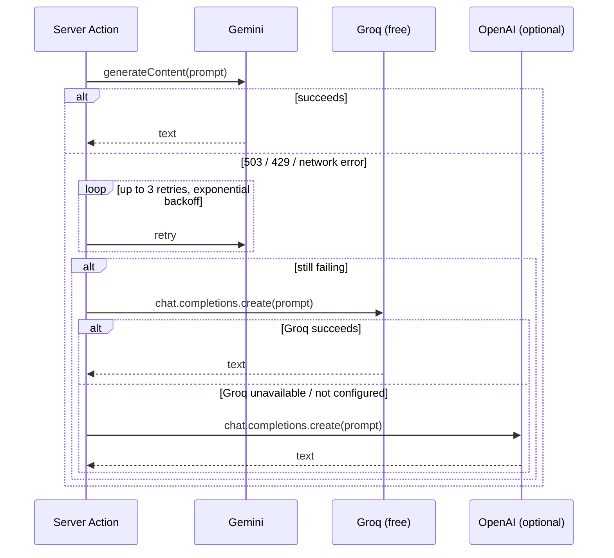
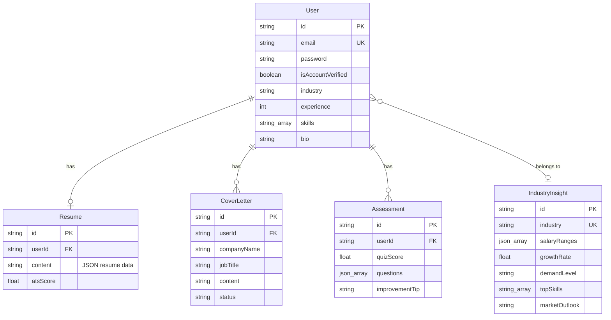

# AI Career Coach

An AI-powered career workspace: build a resume, generate tailored cover letters, practice interviews with AI-generated quizzes, and get personalized industry insights — all from one profile.

**Try it live:** *(add your Vercel URL here after deploying)*
**Demo login:** `demo@example.com` / `Demo@1234` — or just click **"Try demo account"** on the login page. No signup needed, no email verification, pre-populated with a sample resume and cover letter so there's something to look at immediately.

---

## Features

- **Onboarding** — one-time profile setup (industry, sub-industry, experience, skills, bio) that every other feature reads from
- **Industry Insights dashboard** — AI-generated salary ranges, demand level, market outlook, growth rate, top skills, and trends for the user's industry, charted with Recharts. Cached per-industry and shared across users in the same industry, not regenerated per user
- **Resume Builder** — structured form (contact, summary, categorized skills, experience, projects, education, certifications) with a live preview, Markdown export, and a one-page ATS-friendly PDF (three selectable templates) with real clickable links
- **AI Cover Letter Generator** — takes a job title, company, and job description, and produces a tailored letter using the user's actual skills (prioritizing whichever ones the job description mentions)
- **Mock Interview** — AI-generated multiple-choice technical quiz scoped to the user's industry and skills, scored on submission, with an AI-written improvement tip pinpointing the specific knowledge gap behind any wrong answers
- **Auth** — email/password with OTP verification for registration, login, and password reset

---

## Tech stack

| Layer | Choice |
|---|---|
| Framework | Next.js 15 (App Router + a few legacy Pages Router API routes) |
| UI | React 19, Tailwind CSS v4, shadcn/ui (Radix primitives) |
| Database | PostgreSQL via Prisma ORM ([Neon](https://neon.tech) in production) |
| AI | Google Gemini → Groq → OpenAI fallback chain (see diagram below) |
| Auth | JWT in an httpOnly cookie, bcrypt password hashing |
| Email | Nodemailer via Brevo SMTP (or console-logged in local dev) |
| PDF export | @react-pdf/renderer |
| E2E testing | Playwright |

---

## Architecture



## User journey



## AI generation fallback chain

Every AI call (quiz generation, improvement tips, industry insights) goes through `lib/ai-generate.js`, which tries providers in order and only moves to the next one on a real failure — never as a race.



## Data model



---

## Getting started (local development)

### Prerequisites
- Node.js 20+
- Docker Desktop (for local Postgres)

### 1. Clone and install
```bash
git clone https://github.com/prerna701/ai-career-coach.git
cd ai-career-coach
npm install
```

### 2. Start Postgres
```bash
docker compose up -d postgres
```

### 3. Configure environment
```bash
cp .env.example .env
```
Then fill in `.env` — see [Environment variables](#environment-variables) below. For local dev you can leave `EMAIL_BACKEND="console"` so OTPs print to the terminal instead of requiring real SMTP.

### 4. Apply the schema and seed data
```bash
npx prisma migrate deploy
npm run seed:demo   # optional: creates the demo@example.com account
```

### 5. Run it
```bash
npm run dev
```
Visit whatever URL Next.js prints (usually `http://localhost:3000`, but it'll pick another free port if that one's taken).

---

## Environment variables

| Variable | Required | Notes |
|---|---|---|
| `DATABASE_URL` | Yes | Postgres connection string |
| `JWT_SECRET` | Yes | Any long random string (`openssl rand -hex 32`) |
| `GEMINI_API_KEY` | Yes | Free tier at [aistudio.google.com/apikey](https://aistudio.google.com/apikey) |
| `GROQ_API_KEY` | No | Free fallback if Gemini is overloaded — [console.groq.com/keys](https://console.groq.com/keys) |
| `OPENAI_API_KEY` | No | Second fallback, only if you have a paid OpenAI key |
| `EMAIL_BACKEND` | No | Set to `"console"` for local dev to log OTPs instead of sending them. **Never set this in production.** |
| `EMAIL_HOST` / `EMAIL_PORT` / `EMAIL_USER` / `EMAIL_PASS` / `EMAIL_FROM` | Yes (unless `EMAIL_BACKEND=console`) | SMTP credentials — [Brevo](https://brevo.com) has a free tier (300 emails/day) |

---

## Available scripts

| Command | What it does |
|---|---|
| `npm run dev` | Start the dev server |
| `npm run build` | Production build |
| `npm start` | Run a production build |
| `npm run seed:demo` | Seed the public demo account (safe to run against production) |
| `npm run seed:e2e` | Seed a test account used by the E2E suite |
| `npm run test:e2e` | Run the Playwright E2E suite (`e2e/generation-flows.spec.js`) |

---

## Deploying

1. Push to GitHub, then import the repo on [Vercel](https://vercel.com/new)
2. Create a free Postgres database on [Neon](https://neon.tech) and run `npx prisma migrate deploy` against it once
3. Add the environment variables from the table above in Vercel's project settings
4. **Leave `EMAIL_BACKEND` unset** in Vercel — it exists only to disable email sending in local dev
5. Deploy. Run `npm run seed:demo` once against your production `DATABASE_URL` if you want the demo account live there too

### Known limitations
- **Profile picture upload** writes to the local filesystem (`public/uploads`), which doesn't persist on Vercel's serverless functions. Works fine in local dev / on a traditional server; needs Vercel Blob or S3 to work in production.

---

## Project structure

```
ai-career-coach/
├── app/
│   ├── (auth)/              # login, register, OTP verification, password reset
│   ├── (main)/              # onboarding, dashboard, resume, cover letter, interview
│   ├── layout.js            # root layout, forced dark theme
│   └── page.jsx             # landing page
├── actions/                 # server actions (data + AI generation)
├── components/
│   ├── landing/              # landing page sections
│   ├── ui/                   # shadcn/ui primitives
│   └── auth/                 # shared auth form fields
├── lib/
│   ├── ai-generate.js        # Gemini → Groq → OpenAI fallback chain
│   ├── ai-retry.js           # retry-with-backoff for transient AI failures
│   ├── auth.js / jwt.js      # session handling
│   └── mailer.js             # SMTP / console email backend
├── pages/api/                # legacy auth + user API routes
├── prisma/                   # schema + migrations
├── scripts/                  # seed-demo-user.cjs, seed-e2e-user.cjs
├── e2e/                      # Playwright tests
└── docker-compose.yml        # local Postgres (+ migrate/seed service)
```

---

## Testing

```bash
npm run test:e2e
```

Runs a real browser against the app (auth bypassed via a signed JWT, matching how the app itself issues sessions) and verifies the three core generation flows end to end: resume save, cover letter generation, and interview quiz generation — checking actual database state, not just UI text.
